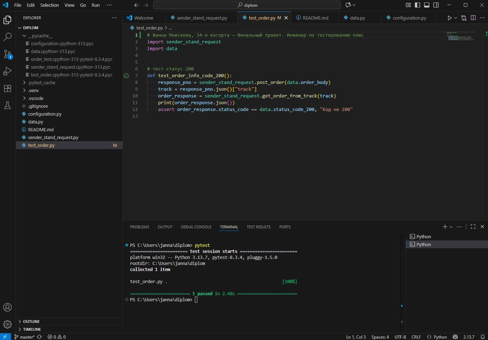

# Практический блок: вторая часть
## <span style="background-color:mistyrose;">Работа с базой данных</span>
**Задание 1**
Вывести список логинов курьеров с количеством их заказов в статусе «В доставке».
```
SELECT
    c.login,
    COUNT(CASE WHEN o."inDelivery" = true THEN 1 END) AS "CountDelivery"
FROM "Couriers" AS c
LEFT JOIN "Orders" AS o
    ON c.id = o."courierId"
GROUP BY c.login;
```
**Задание 2**
Вывести все трекеры заказов и их статусы по заданному правилу.
```
SELECT
    track,
    CASE
        WHEN finished = true THEN 2
        WHEN cancelled = true THEN -1
        WHEN "inDelivery" = true THEN 1
        ELSE 0
    END AS status
FROM "Orders";
```
## <span style="background-color:mistyrose;">Автоматизация теста к API</span>
Автоматизировать подготовленный сценарий.

- Для запуска теста должны быть установлены пакеты pytest и requests
- Запуск теста выполняется командой pytest